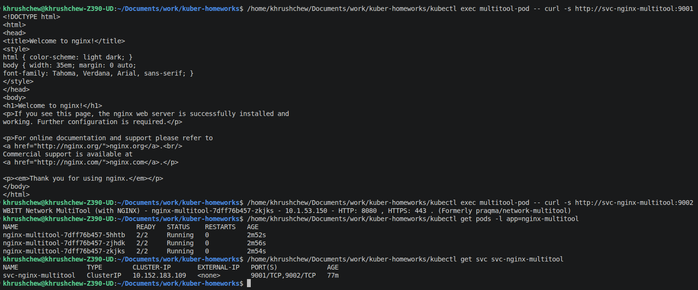
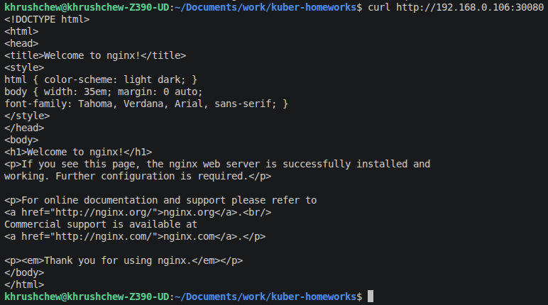
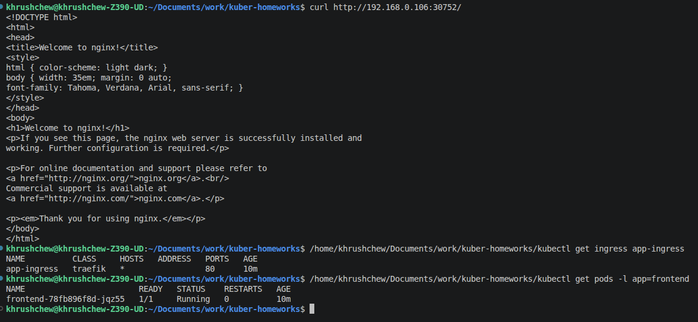
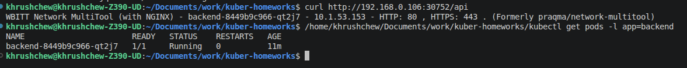

# Домашнее задание к занятию «Сетевое взаимодействие в K8S»

---

## Задание 1. Настройка Service (ClusterIP и NodePort)

### 1. Deployment с nginx и multitool (3 реплики)

Создан Deployment [`deployment-nginx-multitool.yaml`](deployment-nginx-multitool.yaml) с тремя репликами и двумя контейнерами:
- `nginx:1.25` — слушает порт **80**
- `wbitt/network-multitool` — слушает порт **8080** (переопределён через `HTTP_PORT`, чтобы избежать конфликта с nginx)

### 2. Service ClusterIP с маппингом портов

Создан Service [`svc-clusterip.yaml`](svc-clusterip.yaml):
- порт **9001** → nginx (targetPort: 80)
- порт **9002** → multitool (targetPort: 8080)

### 3. Проверка доступности изнутри кластера

Создан Pod [`pod-multitool.yaml`](pod-multitool.yaml). Проверка доступа через ClusterIP Service по DNS-имени:

```bash
kubectl exec multitool-pod -- curl -s http://svc-nginx-multitool:9001
kubectl exec multitool-pod -- curl -s http://svc-nginx-multitool:9002
```

**Ответ nginx на порт 9001 и multitool на порт 9002:**



### 4. Service NodePort для доступа снаружи кластера

Создан Service [`svc-nodeport.yaml`](svc-nodeport.yaml) с типом `NodePort`:
- port: **80** → targetPort: **80** → nodePort: **30080**

### 5. Проверка доступа с локального компьютера

```bash
curl http://192.168.0.106:30080
```

**Вывод curl через NodePort (порт 30080):**



---

## Задание 2. Настройка Ingress

### 1–2. Deployments и Services для frontend и backend

- Deployment [`deployment-frontend.yaml`](deployment-frontend.yaml) — образ `nginx:1.25`, порт 80
- Deployment [`deployment-backend.yaml`](deployment-backend.yaml) — образ `wbitt/network-multitool`, порт 80
- Service [`service-frontend.yaml`](service-frontend.yaml) — `svc-frontend`, порт 80
- Service [`service-backend.yaml`](service-backend.yaml) — `svc-backend`, порт 80

### 3. Ingress-контроллер

В кластере используется **Traefik** в качестве Ingress-контроллера (установлен через MicroK8S).

### 4. Ingress с маршрутизацией по путям

Создан Ingress [`ingress.yaml`](ingress.yaml):
- `/` → `svc-frontend:80` (nginx — frontend)
- `/api` → `svc-backend:80` (multitool — backend, с strip-prefix middleware чтобы срезать `/api` перед передачей в backend)

Traefik слушает на NodePort **30752** (HTTP).

### 5. Проверка доступности через Ingress

```bash
curl http://192.168.0.106:30752/
curl http://192.168.0.106:30752/api
```

**Ответ frontend (/) — nginx:**



**Ответ backend (/api) — multitool:**


